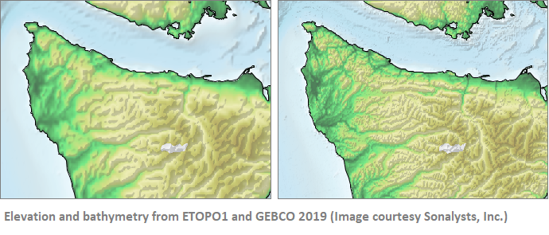
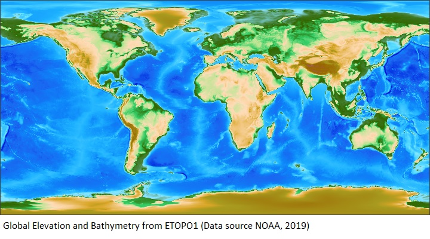
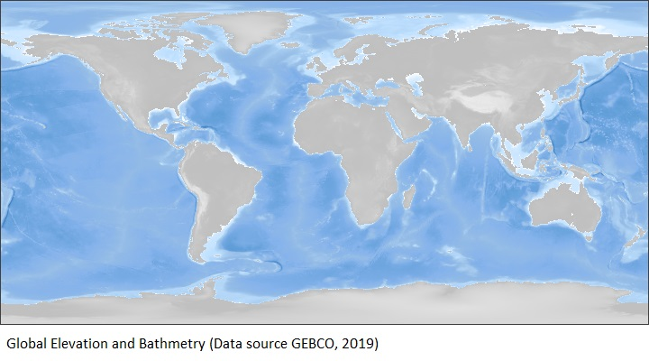

**Under construction -- Corrections and more content coming soon**

# Introduction
Many important and useful public sources of geophysical data are distributed in the
_Network Common Data Format_ or NetCDF. NetCDF is a well supported and flexible
standard that can be adapted to a wide range of data products including both
vector and raster (grid) data types. Examples of the use of NetCDF for raster data
include digital elevation models, satellite imagery, and even ocean currents.
But NetCDF's flexibility brings a level of complexity that sometimes makes
it hard to get started with the NetCDF software libaries. On first inspection
of the API, it is not always clear how to extract data from a NetCDF file.

This article will attempt to assist software developers using NetCDF by presenting
an example implementation of a Java application that uses the NetCDF to
access two geophysical data products: ETOPO1 and GEBCO_2019. Both these
products provide global-scale collections of elevation and ocean-depth (bathymetry)
information.  ETOPO1 features over 233 million data points arranged in a geographic
coordinate system (a latitude/longitude grid) at regular intervals of 1 minute of arc
(equivalent to about 1.85 kilometers at the equator). GEBCO_2019 features more than
3.7 billion data points arranged with a grid spacing of 15 seconds of arc
(equivalent to about 0.46 kilometers).

The figure below illustrates the difference in resolution for the two data sets.

The full source code for the Java application described in this article
is available as part of the "demo" module at  [The Gridfour Software Project](https://github.com/gwlucastrig/gridfour).
in the class [ExtractData.java](https://github.com/gwlucastrig/gridfour/blob/master/demo/src/main/java/org/gridfour/demo/globalDEM/ExtractData.java ).
Some of the code snippets shown below have been modified for use in this article. The examples will help to clarify
how to read NetCDF files in Java.

# Accessing a NetCDF file
Let's get started.  Opening a NetCDF file using the Java API is easy. The code block below shows how:

    // inputPath is a Java string giving the path to a file such as
	//    1.   ETOPO1_Ice_c_gmt4.grd    
	//    2.   GEBCO_2019.nc
    NetcdfFile ncfile = NetcdfFile.open(inputPath);
	
Most NetCDF files end in the file-extension ".nc". The ETOPO1 file is somewhat
unusual in that it is specified with the extension ".grd".

Just like any other file-access API in Java, the NetCDF file functions can throw
I/O exceptions.  Fortunately, the NetCDF authors avoided the temptation to implement
custom exceptions (with a few exceptions), so exception-handling code for NetCDF
is largely the same as for any Java file-based API. For simplicity, the code snippets
in this article omit the exception-handling elements.

## Reading the Data
Having opened the file, it's time for the ExtractData application to extract content.
The primary mechanism for accessing information in a NetCDF file is through the use
of a Java class named _Variable_.  The example below obtains a list of all the 
Variable instances stored in the NetCDF file and prints it using a Java PrintStream
named "ps".  In this example, we initialize ps to System.out, but it could also be
repurposed to write to a text file if we wanted a more permanent record of the extracted
data. When printing to standard output, I have one caveat... The 5.1 version of
the NetCDF Java API had a bug in which it would close standard output when processing
the GEBCO data (but not the ETOPO1). Therefore I recommend that you use
more recent (or earlier) versions of the library. 

	PrintStream ps = System.out;
	NetcdfFile ncfile = NetcdfFile.open(inputPath);
	
	ps.println("Variables found in file:");
	List<Variable> variables = ncfile.getVariables();
	for (Variable v : variables) {
	   ps.println("\n" + v.toString());
	}

Like conventional variables, NetCDF Variable objects are identified by name.
And each Variable may be associated with an underlying standard data type (integer, short, float, etc.).
Variables may store either a single value, an array of values, a grid of values,
and so forth. Part of the flexibility of a NetCDF file is its ability to store multiple data sets
within a single file all with different names, data types, and raster definitions.
Each data set is associated with one or more Variables.

The Java NetCDF Variable class implements quite a good toString() method.  The text below shows
the output from the ETOPO1 data file ETOPO1_Ice_c_gmt4.grd.  Both the ETOPO1 and GEBCO products contain
only three Variables. It is, however, common for NetCDF files to contain dozens of variables (often
including several different kinds of content).

	Variables found in file:

	double x(x=21600);
	  :long_name = "Longitude";
	  :actual_range = -180.0, 180.0; // double
	  :units = "degrees_east";

	double y(y=10800);
	  :long_name = "Latitude";
	  :actual_range = -89.99999999999997, 90.0; // double
	  :units = "degrees_north";

	int z(y=10800, x=21600);
	  :long_name = "z";
	  :_FillValue = -2147483648; // int
	  :actual_range = -10803.0, 8333.0; // double
	  
	  
The angular spacing for the coordinate grid used by ETOPO1 is 1 minute of arc.  There are
60 minutes in one degree. So a grid with a 360-degree range of coverage would include 
360x60 = 21600 columns. And 21600 is, in fact, the order of the Variable x.
The interpretation of the Variable y is a bit more complicated because it
doesn't start and end at the poles (+/- 90 degrees latitude), but the arithmetic is similar.

One thing worth noting here is that the authors of ETOPO1 chose to include Variables defining the
geographic coordinates (latitude and longitude) associated with each row  and column in the grid.
They could have just as easily included variables giving the overall range of the coordinates
or a uniform cell-spacing specification. However, a lot of products currently being
produced in NetCDF format seem to prefer the convention used by ETOPO1. This approach
increases the size of the specifications by a small proportion. But it has the advantage
of flexibility, because it allows for non-uniform coordinate specifications (i.e. rows that
are not equally spaced, columns that are not equally spaced, etc.).

Before we look into how to extract numeric (or text) values from a NetCDF Variable,
let's take a look at the output that would result if we used the same code
as shown above on the GEBCO_2019.nc file.  

	double lon(lon=86400);
	  :standard_name = "longitude";
	  :long_name = "longitude";
	  :units = "degrees_east";
	  :axis = "X";
	  :sdn_parameter_urn = "SDN:P01::ALONZZ01";
	  :sdn_parameter_name = "Longitude east";
	  :sdn_uom_urn = "SDN:P06::DEGE";
	  :sdn_uom_name = "Degrees east";
	  
	double lat(lat=43200);
	  :standard_name = "latitude";
	  :long_name = "latitude";
	  :units = "degrees_north";
	  :axis = "Y";
	  :sdn_parameter_urn = "SDN:P01::ALATZZ01";
	  :sdn_parameter_name = "Latitude north";
	  :sdn_uom_urn = "SDN:P06::DEGN";
	  :sdn_uom_name = "Degrees north";

	float elevation(lat=43200, lon=86400);
	  :long_name = "Elevation relative to sea level";
	  :units = "m";
	  :sdn_parameter_urn = "SDN:P01::ALATZZ01";
	  :sdn_parameter_name = "Sea floor height (above mean sea level) {bathymetric height}";
	  :sdn_uom_urn = "SDN:P06::ULAA";
	  :sdn_uom_name = "Metres";
	  :standard_name = "height_above_reference_ellipsoid";
	  :_ChunkSizes = 1U, 86400U; // uint

As you can see, the GEBCO product uses different variable names than
ETOPO1. The choice of variable names is a matter of convention and taste. In the GEBCO product,
the dimensions of the lon and lat Variables are four times that of the corresponding
x and y Variables used in ETOPO1.  These parameters reflect the factor
of four difference in resolution (15 seconds of arc for GEBCO versus the
60 minutes of arc used for ETOPO1). The GEBCO product also includes
a few more descriptive data items than the ETOPO1 product had (including
units-of-measure, sdn_parameter_name, etc.).  The NetCDF Java API uses the term "attribute"
to describe these items. The role of NetCDF attributes used in relation to
Variables is similar to the role of attributes in XML specifications.  Just as an
XML attribute provides supplemental or descriptive data for the XML element that includes it,
a NetCDF attribute provides supplemental or descriptive data for the Variable to which
it belongs.

## Extracting the Grid Data from the Raster Variable
For the ExtractData demonstration application, I wanted to produce a result
that would indicate whether the data had been extracted correctly. And it seemed
like an output image would be a good indicator of success. So the ExtractDemo
application uses the elevation and bathymetry data from the NetCDF source files
to create a 720 pixel wide by 360 pixel high image.  Each pixel in the image is
the average of some number of depth/elevation values from the source files
(30x30 = 900 values per pixel for ETOPO1, 120x120=14400 values per pixel for GEBCO).

The rasters in both these products are given in row-major order. In other words,
when we extract data, we can use two nested loops.  The outer loop loops on row,
the inner on column. 

How do we know that the data is in row-major order?  One clue is to look at
the first line for the toString() output from the "z" and "elevation" variables:

	int z(y=10800, x=21600)
	float elevation(lat=43200, lon=86400)

In both cases, the row-related variable (y or lat) is listed first
followed by the column-related variable (x or lon). This fact suggests that
the secondary argument (the column element) varies more quickly than the
primary argument (row). That, in turn, suggests the order in which we can access the data
most efficiently.

Of course, to read the content of those variables in code, we need to 
invoke one of the access methods in the NetCDF API to obtain the Variables
of interest. Upon inspecting the output from the Variable toString() methods
shown above, we know the names of the Variables associated with the raster (grid).
Extracting them from the NetCDF file is just a matter of implementing a
if/then statement based on which product we are processing:

    Variable z; // the variable that ExtractData uses for elevation and bathymetry
    if (product.startsWith("ETOP")) {
      z = ncfile.findVariable("z");
    } else {
      // the product is GEBCO
      z = ncfile.findVariable("elevation");
    }

Next, we need to obtain the dimensions of the grid stored in the
raster Variable from the NetCDF file:

    int rank = z.getRank();
    int[] shape = z.getShape();  // will be an array int[rank].

    int nRows = shape[0];
    int nCols = shape[1];
    ps.format("Rows:      %8d%n", nRows);
    ps.format("Columns:   %8d%n", nCols);

The _rank_ of a NetCDF variable is essentially the dimensions of the Variable.
A grid has rows and columns, so the z/elevation Variables have a rank of 2.
The latitude and longitude related variables both have rank of 1.  The _shape_
array allows NetCDF to pass back information about the size of each
set of elements contained in the Variable.

The NetCDF API allows an application to access a Variable's content in any order
that it requires. However, just like any other file-based data format, the most
efficient access follows the sequence on which the data is organized in the
file. Because the data is in row-major order, we access it one row at a time.
This is not always the most optimal pattern for access, and sometimes when
reading a NetCDF file, an application needs to be aware of a feature called
a "chunk size".  We'll discuss more about that later on. For now, we can access
the data using logic in the form shown below.  

In the logic that follows, the application code tells NetCDF the size of the
block of data it wishes to retrieve by using two arrays sized to the
rank of the data set. The readOrigin array tells NetCDF where the application
wishes to start reading data. The readShape tells NetCDF the dimensions of
the block of data the application wishes to retrieve. The return from
a Variable's "read" operation is a NetCDF Array.   The array is a one-dimensional
array of readShape[0]*readShape[1] elements, given in row-major order.

	// define two integer arrays
	int[] readOrigin = new int[rank];
	int[] readShape = new int[rank];
	for (int iRow = 0; iRow < nRows; iRow++) {
	   // set up to read the entire row, but just one row.
	   readOrigin[0] = iRow;  // rows are numbered from zero
	   readOrigin[1] = 0;     // columns are numbered from zero
	   readShape[0]  = 1;     // read one row
	   readShape[1]  = nCols; // read the entire set of columns for that row

	   Array array = z.read(readOrigin, readShape);
	   for (int iCol = 0; iCol < nCols; iCol++) {
	      double sample = array.getDouble(iCol);
	      // transfer sample to the collection of data for the picture.
	   }
	}

	ncfile.close();   // always a good idea.
	
The example above omits the logic for transcribing the input data to the
image, but you can find it in the source code for 
[ExtractData.java](https://github.com/gwlucastrig/gridfour/blob/master/demo/src/main/java/org/gridfour/demo/globalDEM/ExtractData.java)
which is posted on the Gridfour Software Project page.  The results are shown below.

## The Chunk Size
If you look at the output from the toString() method for the elevation Variable
used for GEBCO 2019, you see that it includes an attribute called "chunk size".

	float elevation(lat=43200, lon=86400);
	:_ChunkSizes = 1U, 86400U; // uint

The chunk size is an optional parameter that allows applications to organize the
layout of data on disk.  The default layout for grid products is in a row-major
form, and if the chunk size is omitted (as it was in the ETOPO1 product), that
is what will be used. The design for applications that perform intensive access
to a NetCDF file should pay attention to the chunk size.  A pattern
of access that follows the sequence in which data is laid out within a file
will usually operate more efficiently than one that does not. 

Fortunately, the data access in the Java API for NetCDF is quite efficient.
For moderate data access requirements, the order of access doesn't matter.
But for intense operations, it can make a difference.  For example,
running ExtractData on ETOPO1 requires only a few seconds of run time.
However, as an experiment I modified the ExtractData code to read the NetCDF
file one column at a time rather than one row at a time. The operation took
over 20 minutes. Of course, that pattern of access was pretty much the worst possible
way to access the ETOPO1 product and was equivalent to reading through the entire
file several thousand times. So as long as your application pays attention to
the design of the data product, it the NetCDF API should provide acceptable performance.

# An Extra
Given that we have two excellent global bathymetry products at our disposal,
I thought it would be interesting to do something with that data.
Did you every wonder how much water is in the world's oceans? Having data
collections of, literally, millions of bottom-depth values should
allow us to make some estimates.

Each grid cell in the ETOPO1 and GEBCO_2019 data sets covers a distinct
portion of the Earth's surface. The overall area of these cells varies as
a function of latitude.  Knowing the row spacing for the various products
and applying a bit of elementary calculus allows us to compute these areas.
The code for the calculation can be found in the demonstration class
[ExtractionCoordinates.java](https://github.com/gwlucastrig/gridfour/blob/master/demo/src/main/java/org/gridfour/demo/globalDEM/ExtractionCoordinates.java)
which implements a method called getAreaOfEachCellInRow().  As it reads data from
the NetCDF files, the ExtractData application looks for sample points that
give negative values (indicating elevations below mean sea level).  Although
it's not a perfect technique (i.e. Death Valley is below sea level),
this approach provides a good high-order estimate.  The results are shown below:

| Computation           | ETOPO1                    | GEBCO_2019             |
| --------------------- | ------------------------- | ---------------------- |
| Ocean Volume          | 1334139199 km3    | 1336850835 km3 |
| Surface Area          |  361782018 km2    |   361747563 km2 |
| Avg. Depth            |       3435 m              |      3448 m              |  
  
The numbers printed by the Gridfour application show more digits of precision that is actually
supported by the data.  The extra digits are intended for testing purposes and should be viewed with
an appropriate skepticism. The difference in results for the data two products is a consequence
of their different grid cell size and data sources.

Incidentally, NOAA has posted its own results based on the ETOPO1 data set at 
[NOAA's Volumes of the World's Oceans](https://www.ngdc.noaa.gov/mgg/global/etopo1_ocean_volumes.html)
They cite an estimate for the volume of 1,335,000,000 km3 which is close to the
Gridfour result.  They also offer an error estimate of 1% which provides a useful insight into
how NOAA views the quality of the data. Given the many unknowns in surveying the world's oceans,
one percent isn't bad...

# Conclusion
While this discussion covered the most important features of the NetCDF API,
there are a number of additional features available for your use. Furthermore,
NetCDF is not limited to raster (grid) based products such as those discussed
in this wiki article. It can also support vector products (lines, point features,
polygons, etc.).

Readers who would like to learn more about the NetCDF internals and API may do
so by visiting the official [NetCDF Java Tutorial](https://www.unidata.ucar.edu/software/netcdf-java/current/tutorial/index.html). You can also find additional examples and
"insider" information about the  [Unidata NetCDF Java](https://www.unidata.ucar.edu/software/netcdf-java/) page.

I hope this article will help simplify some of the issues in getting started with the Java NetCDF API.
I wish you the best of luck on all of your endeavors.

 
# References
General Bathymetric Chart of the Oceans [GEBCO], 2019. _GEBCO Gridded Bathymetry Data_.
Accessed December 2019 from [https://www.gebco.net/data_and_products/gridded_bathymetry_data/](https://www.gebco.net/data_and_products/gridded_bathymetry_data/)

National Oceanographic and Atmospheric Administration [NOAA], 2019.
_ETOPO1 Global Relief Model_. Accessed December 2019 from [https://www.ngdc.noaa.gov/mgg/global/](https://www.ngdc.noaa.gov/mgg/global/)

Sonalysts, Inc., 2019. _wXstation_. Accessed December 2019 from [http://www.sonalysts.com/products/wxstation/](http://www.sonalysts.com/products/wxstation/)

University Corporation for Atmospheric Research [UCAR], 2019. _NetCDF-Java Library_
Accessed December 2019 from [https://www.unidata.ucar.edu/software/netcdf-java/current/](https://www.unidata.ucar.edu/software/netcdf-java/current/)

 